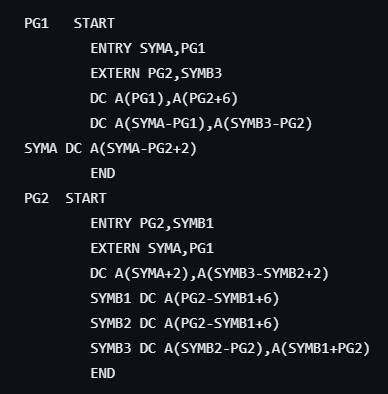
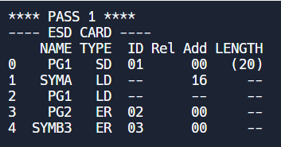
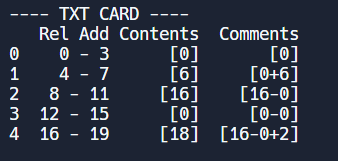
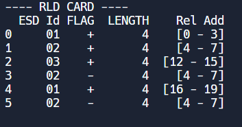
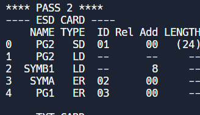
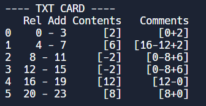
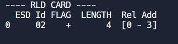

# Implementation of LOADER

### This are Instructions

## Here is how it LOOKS
<table>
  <tr>
    <th>ESD CARD PASS I</th>
    <th>TXT CARD PASS I</th>
    <th>RLD CARD PASS I</th>
  </tr>
  <tr>
    <td></td>
    <td></td>
    <td></td>
  </tr>
   
  <tr>
    <th>ESD CARD PASS II</th>
    <th>TXT CARD PASS II</th>
    <th>RLD CARD PASS II</th>
  </tr>
  <tr>
    <td></td>
    <td></td>
    <td></td>
  </tr>
</table>
